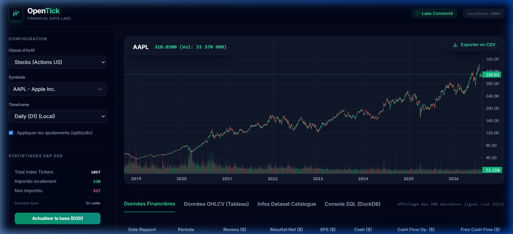
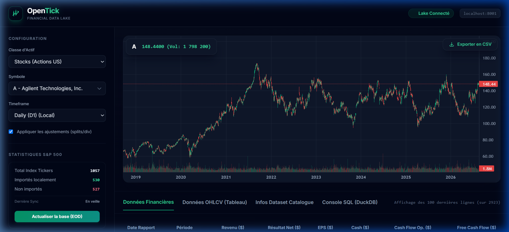
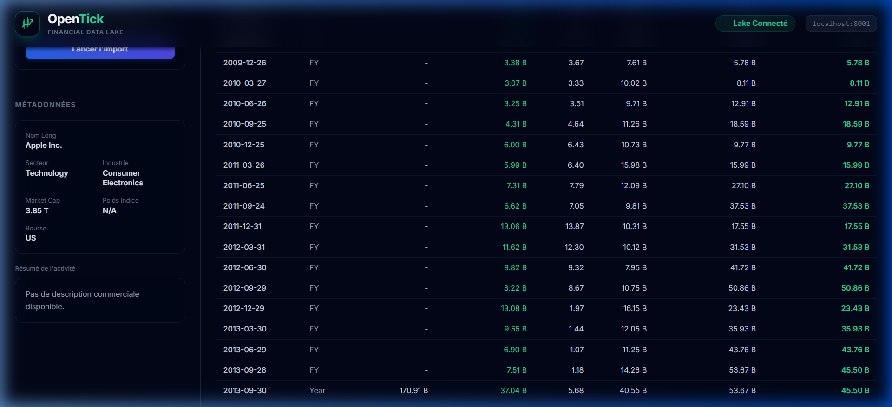
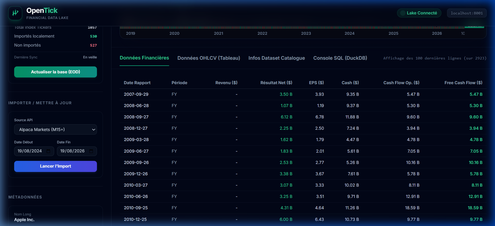
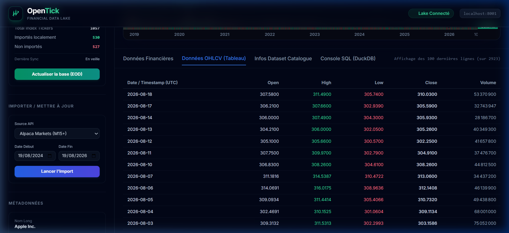
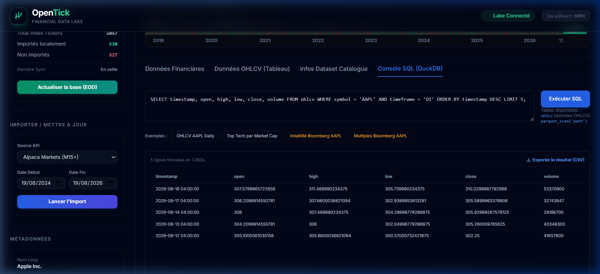
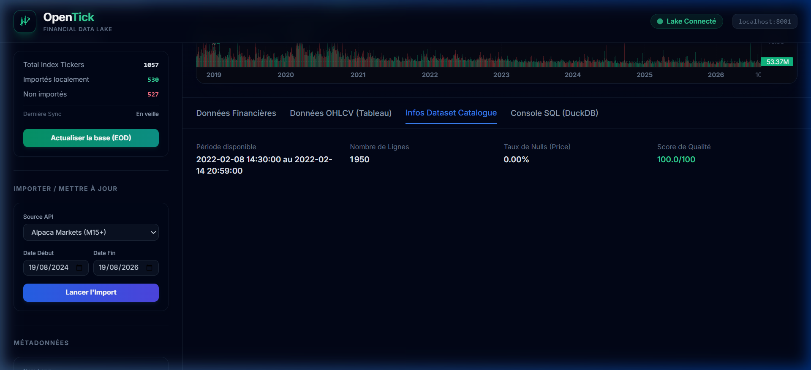

<div align="center">


# OpenTick Core — Financial Data Lake & Quant SDK

**Self-hosted, sub-millisecond financial data infrastructure for quantitative researchers and algorithmic traders.**

[](https://www.python.org/)
[](https://fastapi.tiangolo.com/)
[](https://duckdb.org/)
[](LICENSE)

</div>

---

## ⚡ What is OpenTick?

OpenTick is a **high-performance, local-first financial data lake** designed to consolidate, clean, and query massive historical market datasets without the overhead of cloud databases. 

By pairing **Apache Parquet (Hive partitioned)** with **DuckDB**, OpenTick delivers sub-millisecond query performance directly on raw files, making it the perfect backplane for backtesting, machine learning, and quantitative research.

---

## 🖥️ Interactive Data Explorer — Feature Walkthrough

The platform includes a built-in visual sandbox running on `http://localhost:8001` that allows you to inspect the health, coverage, and contents of your local data lake.

### 📈 1. High-Fidelity Interactive Charts
Visualize price action using official **TradingView-style interactive charts** featuring real-time candle metrics and volume overlays. Hovering over candles updates the metadata panel and header metrics instantly.

<p align="center">
  
</p>

### 🔍 2. Dynamic Real-Time Symbol Search
A custom search combobox filters through thousands of symbols in real time, matching tickers and company names instantly (`AAPL - Apple Inc.`, `MSFT - Microsoft Corp.`) for a seamless UX.

<p align="center">
  
</p>

### 📊 3. Left Metadata & Business Activity Panel
Shows complete corporate profiles mapped directly to the active symbol. This includes Sector, Industry, Market Capitalization, Index weights, and a full corporate summary dynamically synced from index database files.

<p align="center">
  
</p>

### 💵 4. Dynamic Financials & Asof-Joined Fundamentals
Displays historical quarterly income statements, balance sheets, and cash flows. The backend processes corporate filings in real-time, matching them with trading days via `asof` backward-joins to represent true point-in-time financial state without lookahead bias.

<p align="center">
  
</p>

### 📋 5. Raw OHLCV Price Tables
View raw timestamped prices directly in a tabular view. The table loads thousands of bars in milliseconds, showing timestamp (UTC), Open, High, Low, Close, and Volume.

<p align="center">
  
</p>

### 💻 6. Embedded SQL Console (Powered by DuckDB)
Query the entire data lake with standard SQL. DuckDB reads directly from compressed Parquet files, allowing you to run analytical queries, filters, and aggregations with sub-millisecond execution times.

<p align="center">
  
</p>

### 📊 7. Dataset Catalog & Quality Assurance
Inspect coverage dates, row counts, and auto-calculated **Quality Scores** (evaluating missing bars, null values, and OHLCV logical consistency) to ensure your data is production-ready.

<p align="center">
  
</p>

---

## 📥 Consolidated CSV Export

Clicking the **"Exporter en CSV"** button exports a single, fully consolidated CSV file that blends both market price action and fundamental corporate metrics.

### What the CSV Contains:
The exported CSV aligns daily price bars with quarterly fundamentals using a strict `backward-fill` join, meaning quarterly numbers are carried forward daily until a new report is released. This provides a complete matrix for backtesting or machine learning features:
- `date` & `symbol` (UTC aligned)
- `open`, `high`, `low`, `close`, `volume`
- `realized_vol_30d` & `implied_vol`
- `pe_ratio`, `price_to_book`, `beta_raw`, `beta_adj`
- `revenue`, `net_income`, `eps`, `cash`, `free_cash_flow`

---

## 🐍 Python Quant SDK & Local Database Link

You can link your python code directly to the local data files without launching any database engines. The SDK leverages DuckDB to query Parquet files on disk at CPU-bound speeds.

### How to Link Your Local Files:
Simply install the requirements and set the `OPENTICK_DATA_ROOT` environment variable in your script pointing to your `opentick-data` directory.

```python
import os
# Configure the path to your data folder (containing lake/, bloomberg/, catalog.db)
os.environ["OPENTICK_DATA_ROOT"] = "C:/Users/DELL/Desktop/opentick-data"

from tvdata import get_ohlcv, get_macro, get_fundamentals, sql

# ─── Load OHLCV Data (Stocks, Forex, Crypto) ─────────────────────
# Returns clean Pandas DataFrames instantly
aapl_daily  = get_ohlcv("AAPL", "D1")     # Daily adjusted
aapl_1h     = get_ohlcv("AAPL", "1h")     # Hourly intraday
aapl_15m    = get_ohlcv("AAPL", "15m")    # 15-minute bars
btc_daily   = get_ohlcv("BTCUSDT", "D1")  # Crypto

# ─── Portfolio Loading ──────────────────────────────────────────
# Load multiple symbols simultaneously
portfolio = get_ohlcv(["AAPL", "MSFT", "GOOGL", "NVDA"], "D1")

# ─── Macroeconomic Series (FRED) ───────────────────────────────
cpi   = get_macro("CPIAUCSL")  # Consumer Price Index
rates = get_macro("FEDFUNDS")  # Effective Federal Funds Rate

# ─── Fundamental Metrics ────────────────────────────────────────
# EPS, PE Ratio, Revenue, Free Cash Flow, Debt/Equity, etc.
fundamentals = get_fundamentals("AAPL")

# ─── Direct High-Performance SQL ──────────────────────────────
# Leverage DuckDB for lightning-fast analysis
top_symbols = sql("""
    SELECT symbol, timeframe, COUNT(*) as bars,
           MIN(timestamp) as start_date, MAX(timestamp) as end_date
    FROM ohlcv
    WHERE asset_class = 'stocks' AND timeframe = 'D1'
    GROUP BY symbol, timeframe
    ORDER BY bars DESC
    LIMIT 10
""")
```

---

## ⚙️ Quant Ecosystem Integration

OpenTick interfaces natively with standard Python backtesting, optimization, and ML frameworks.

```python
# ─── Backtrader (Backtesting) ──────────────────────────────────
import backtrader as bt
cerebro = bt.Cerebro()
cerebro.adddata(bt.feeds.PandasData(dataname=get_ohlcv("SPY", "D1")))
cerebro.run()

# ─── QuantStats (Performance & Risk Analytics) ──────────────────
import quantstats as qs
returns = get_ohlcv("SPY", "D1")["close"].pct_change().dropna()
qs.reports.html(returns, benchmark="SPY", output="report.html")

# ─── PyPortfolioOpt (Portfolio Optimization) ───────────────────
from pypfopt import EfficientFrontier, expected_returns, risk_models
prices = get_ohlcv(["AAPL", "MSFT", "GOOGL", "NVDA"], "D1").pivot(
    index="timestamp", columns="symbol", values="adj_close"
)
mu = expected_returns.mean_historical_return(prices)
S  = risk_models.CovarianceShrinkage(prices).ledoit_wolf()
weights = EfficientFrontier(mu, S).max_sharpe()

# ─── ML Feature Engineering ─────────────────────────────────────
# Calculate momentum, rolling volatility, and fundamentals on the fly
features = sql("""
    SELECT symbol, timestamp, close, volume,
           realized_vol_30d, implied_vol, pe_ratio, beta_adj,
           (close - LAG(close, 20) OVER (PARTITION BY symbol ORDER BY timestamp))
           / LAG(close, 20) OVER (PARTITION BY symbol ORDER BY timestamp) as momentum_20d
    FROM ohlcv_consolidated
    WHERE asset_class = 'stocks' AND timeframe = 'D1'
""")
```

---

## 📊 Data Coverage & Sources

OpenTick aggregates data from standard APIs and highly reliable, institutional-grade vendors. 

| Asset Class | Coverage | Timeframes | Source / Provider |
|-------------|-----------|------------|-------------------|
| **US Stocks** | 2022 → Today | D1, H1, 4H, M15, M1 | Public APIs & Licensed Market Feeds |
| **Forex** | 2018 → Today | D1, H1, M15 | Institutional Liquidity Providers |
| **Crypto** | 2018 → Today | D1, H1, M15 | Major Public Exchanges |
| **Macro Data** | 1950 → Today | Monthly / Qtr | FRED — Federal Reserve Bank (Public Domain) |
| **Corporate Filings** | 2016 → Today | Quarterly | SEC EDGAR XBRL (Public Domain) |
| **Fundamentals** | 2016 → Today | Quarterly | Selected Reliable Third-Party Providers |
| **Options** | 2019 → Today | EOD | Options Clearing Houses & End-of-Day Feeds |

---

## 🏗️ Technical Architecture

OpenTick stores data in columnar Parquet files on disk and runs queries in-process, bypassing the latency of client-server databases.

```
+----------------------------------------------------------+
|                   OpenTick Stack                         |
|                                                          |
|  +------------------+    +---------------------------+   |
|  |   Data Explorer  |    |    tvdata Python SDK      |   |
|  |  FastAPI + UI    |    |  get_ohlcv()  sql()       |   |
|  |  :8001           |    |  get_macro()  get_fund()  |   |
|  +--------+---------+    +-------------+-------------+   |
|           |                            |                  |
|           +----------------------------+                  |
|                          |                               |
|         +----------------v-----------------+             |
|         |         Apache Parquet           |             |
|         |    lake/ (Hive partitioning)     |             |
|         | asset_class / timeframe / symbol |             |
|         +----+----------+----------+-------+             |
|              |          |          |                     |
|           DuckDB    SQLite      Catalog                  |
|          (Queries)  (catalog.db) (metadata)              |
+----------------------------------------------------------+
```

- **Apache Parquet**: Columnar storage with Snappy compression (~80% space saving vs CSV).
- **DuckDB**: Fast, serverless analytical engine designed for SQL queries on columnar data.
- **Hive Partitioning**: `asset_class/timeframe/symbol` structure guarantees sub-10ms query execution times by pruning irrelevant directories before scanning.
- **SQLite Catalog**: Light, local registry storing data indices, symbol profiles, and data quality metrics.
- **Strict UTC Timezone Normalization**: Ingestion connectors enforce timezone normalization to ensure exact cross-asset timing alignment.

---

## 🔌 Available Connectors

Included out-of-the-box in the SDK:
- `alpaca_connector` — Intraday stock prices (requires free API key).
- `binance_connector` — Crypto OHLCV (no key required).
- `fred_connector` — Macroeconomic time series (requires free FRED API key).
- `sec_connector` — SEC EDGAR fundamentals parser.
- `dolt_connector` — Option chains and earnings datasets.
- `metatrader` — Institutional Forex history from MT4/MT5.
- `update_all_stocks` — Automatic daily EOD indexing script.

---

## 🤝 Contact & Collaboration

This repository contains the **core source code** (SDK, connectors, and Data Explorer UI). The historical dataset (~22 GB of pre-built Parquet files) is distributed separately.

### Get in Touch:
- 🗄️ **Get Data Lake Access**: Open an [Issue on GitHub](https://github.com/EA1904/opentick-core/issues) to request the historical data archive.
- 🤝 **Collaborate**: If you are a quantitative researcher, analyst, or developer looking to integrate OpenTick into your pipeline, reach out via my [GitHub Profile](https://github.com/EA1904).
- 🐛 **Contribute**: Feel free to submit a Pull Request or open an issue for connector upgrades and bug fixes.

---

## Disclaimer

> **For research and educational purposes only.** 
> OpenTick is a data infrastructure tool and does not constitute financial advice. Always verify data independently before risking capital. Data is fetched in compliance with API terms of service.

---

## License

MIT — See [LICENSE](LICENSE).

<div align="center">

**OpenTick Core — Open-Source. Local-First. Free.**

*Designed with ❤️ for quant researchers and system traders.*

**[@EA1904](https://github.com/EA1904)**

</div>
