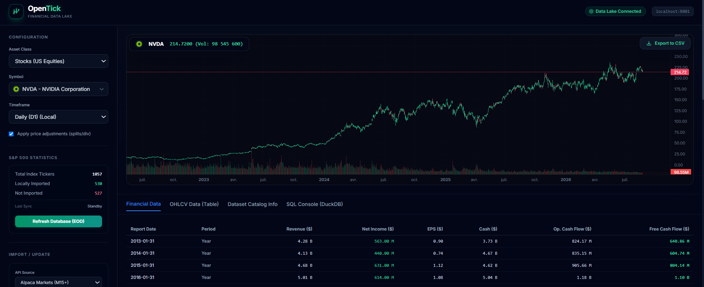
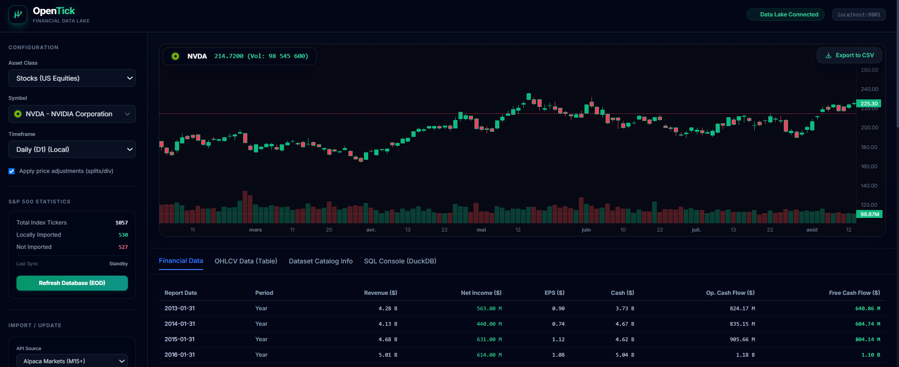
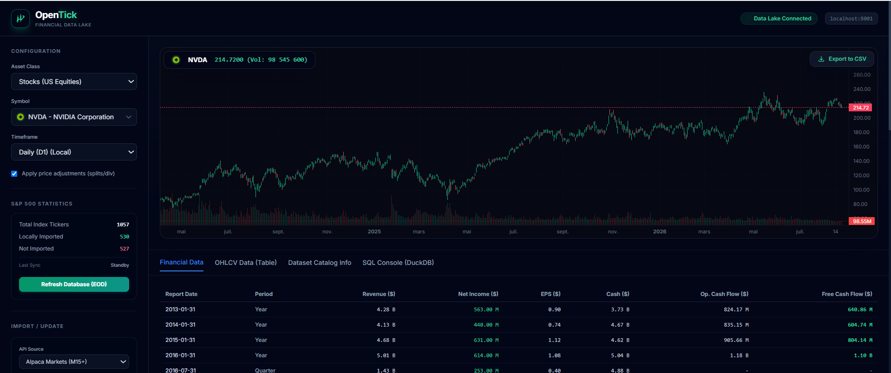
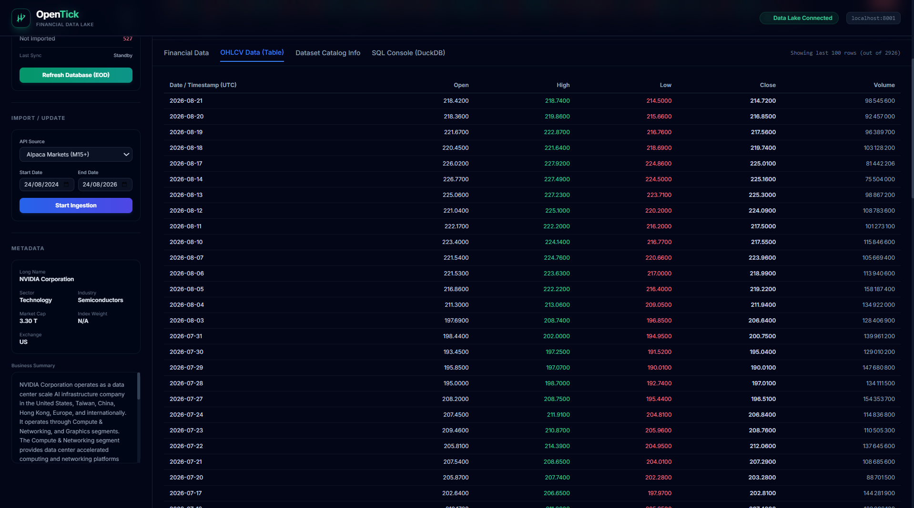

<div align="center">


# 🗄️ OpenTick — Financial Data Lake

**Your single source of truth for all trading data.**
Self-hosted, portable, 100% free — deployed with a single `docker compose up`.

[](https://www.python.org/)
[](https://fastapi.tiangolo.com/)
[](https://duckdb.org/)
[](https://docs.docker.com/compose/)
[](https://nextjs.org/)
[](LICENSE)

---

**530+ symbols** &nbsp;·&nbsp; **6 asset classes** &nbsp;·&nbsp; **10+ years of history** &nbsp;·&nbsp; **Sub-second DuckDB queries** &nbsp;·&nbsp; **5 data connectors**

</div>

---

## 📋 Table of Contents

- [Why OpenTick?](#-why-opentick)
- [What is OpenTick?](#-what-is-opentick)
- [Live Demo — NVDA](#%EF%B8%8F-live-demo--nvda-nvidia-corporation)
- [Architecture](#%EF%B8%8F-architecture)
- [Data Coverage](#-data-coverage)
- [Performance Benchmarks](#-performance-benchmarks)
- [Use Cases](#-use-cases)
- [Quick Start](#-quick-start-docker--recommended)
- [API Keys](#%EF%B8%8F-api-keys-configuration)
- [Project Structure](#-project-structure)
- [Python SDK](#-python-sdk--usage)
- [Data Ingestion](#-data-ingestion)
- [Manual Setup](#-manual-setup-without-docker)
- [Tests](#-tests)
- [Roadmap](#%EF%B8%8F-roadmap)
- [Contributing](#-contributing)
- [License](#-license)

---

## 🤔 Why OpenTick?

As quants and data scientists, we were spending **more time cleaning and managing data infrastructure than building models**.

- **Free APIs** (Yahoo Finance) hit rate limits, have missing data, and break unpredictably
- **Professional terminals** (Bloomberg, Refinitiv) cost $20k+/year and restrict automation
- **Scattered sources** — price data here, fundamentals there, macro elsewhere — hours of wrangling before any analysis

**OpenTick solves this**: centralises 500+ time series (Prices, Fundamentals, Macro, Options) into a Parquet data lake with sub-second DuckDB queries, eliminating 90% of data wrangling before any backtest or model run.

---

## ✨ What is OpenTick?

OpenTick is a **full-stack financial data platform** designed for quants, data scientists, and algorithmic traders. It aggregates, normalises, and exposes 500+ US equities (S&P 500), Forex, Crypto, and macro time series in a **high-performance Parquet Data Lake**.

### 🔑 Key Features

| Feature | Detail |
|---|---|
| 📊 **Parquet Data Lake** | Hive partitioning `asset_class / timeframe / symbol` — sub-second DuckDB queries |
| 🌐 **Data Explorer UI** | Interactive web interface with real-time charts, symbol search, financial data, and CSV export |
| 🔌 **5 Connectors** | Yahoo Finance, Alpaca Markets, Binance, FRED API, SEC EDGAR |
| 🤖 **Auto-Updater** | Daily incremental End-of-Day price update — runs automatically |
| 🐳 **1-Click Docker** | Entire stack in a single `docker compose up --build` |
| 📦 **Python SDK** | `from tvdata import get_ohlcv, get_macro, get_fundamentals` |
| 🧮 **SQL Console** | DuckDB SQL directly on your Parquet lake from the browser |
| 📤 **Flexible Export** | CSV/ZIP export with custom date range, timeframe, and data type selection |

---

## 🖥️ Live Demo — NVDA (NVIDIA Corporation)

> All screenshots below are taken directly from a live, locally-running instance of OpenTick.

### Interactive Candlestick Chart — Full History 2022 → 2026

The Data Explorer loads any S&P 500 symbol with **split/dividend-adjusted prices**, interactive zoom, and volume bars. Here, NVDA's AI-driven rally from ~$12 to $225 is captured in full — **from AI boom to market leadership**.



---

### Zoom on Recent Price Action — 2026

Drill into any period with the interactive chart. Daily Open/High/Low/Close candles with volume for NVDA's most recent trading sessions.



---

### Financial Data — Revenue, EPS, FCF (2013 → 2026)

The **Financial Data** tab exposes all quarterly and annual earnings pulled from SEC EDGAR and Bloomberg. Metrics include Revenue, Net Income, EPS, Cash, Operating Cash Flow, and Free Cash Flow — color-coded green for profit, red for loss.



Full financial history scrolled — watch NVIDIA's Revenue explode from **$4.28B (2013)** to **$215.94B (2026 Annual)** and Free Cash Flow reaching **$96.68B**:


---

### OHLCV Data Table — 2,926 Daily Bars with Metadata Sidebar

The **OHLCV Data (Table)** tab exposes raw price data rows up to the latest available date (**2026-08-21**). The sidebar shows:
- Company metadata: Sector **Technology**, Industry **Semiconductors**, Market Cap **$3.30T**
- Exchange: **US**
- Full **Business Summary** from yfinance (NVIDIA Corporation operates as a data center scale AI infrastructure company...)



---

### SQL Console — DuckDB Queries Directly on the Lake

Query your entire Parquet data lake with **raw DuckDB SQL** straight from the browser. No server, no ORM — direct columnar queries in milliseconds.

```sql
-- Top 5 most recent NVDA daily bars
SELECT timestamp, open, high, low, close, volume
FROM ohlcv
WHERE symbol = 'NVDA' AND timeframe = 'D1'
ORDER BY timestamp DESC LIMIT 5;

-- Top tech companies by total volume
SELECT symbol, SUM(volume) as total_volume, AVG(close) as avg_price
FROM ohlcv WHERE asset_class = 'stocks' AND timeframe = 'D1'
GROUP BY symbol ORDER BY total_volume DESC LIMIT 10;
```


Pre-built query examples included: **OHLCV NVDA Daily**, **Top Tech by Market Cap**, **Bloomberg Volatility**, **Bloomberg Multiples**.

---

### Export Configuration — Granular Multi-Format Export

Click **Export to CSV** from any symbol view to open the Export Configuration modal. Fully configurable:

<table>
  <tr>
    <td align="center" width="50%">
      <b>Price Series Export</b><br/>
      Custom date range · Single CSV or ZIP<br/>
      Timeframes: 15m · 1h · 4h · Daily (D1)
      <br/><br/>
      
    </td>
    <td align="center" width="50%">
      <b>Fundamentals &amp; Derivatives Export</b><br/>
      Income Statement · Balance Sheet · Cash Flow<br/>
      Option Volatility HV/IV · Corporate Actions
      <br/><br/>
      
    </td>
  </tr>
</table>

---

## 🏗️ Architecture

```
┌──────────────────────────────────────────────────────────────────┐
│                       OpenTick Stack                             │
│                                                                  │
│  ┌──────────────┐  ┌──────────────┐  ┌──────────────────────┐  │
│  │  Frontend    │  │   Backend    │  │    Data Explorer     │  │
│  │  Next.js 14  │  │  FastAPI     │  │  FastAPI + HTML/JS   │  │
│  │  :3000       │  │  :8000       │  │  :8001               │  │
│  └──────┬───────┘  └──────┬───────┘  └──────────┬───────────┘  │
│         └─────────────────┼──────────────────────┘              │
│                           │                                      │
│              ┌────────────▼─────────────┐                        │
│              │    tvdata Python SDK     │                        │
│              │  get_ohlcv()  sql()      │                        │
│              └──────────┬───────────────┘                        │
│                         │                                        │
│         ┌───────────────┼───────────────┐                        │
│         ▼               ▼               ▼                        │
│   ┌──────────┐   ┌──────────┐   ┌─────────────┐                 │
│   │  Parquet │   │  DuckDB  │   │   SQLite    │                 │
│   │  lake/   │   │ (Queries)│   │ catalog.db  │                 │
│   └──────────┘   └──────────┘   └─────────────┘                 │
│         ▲                                                        │
│   ┌─────┴────────────────────────────────────────┐               │
│   │  yfinance │ Alpaca │ Binance │ FRED │ SEC   │               │
│   └───────────────────────────────────────────────┘               │
└──────────────────────────────────────────────────────────────────┘
```

### Tech Stack

| Layer | Technology | Role |
|--------|-------------|------|
| Storage | **Apache Parquet** | Columnar, 80% compression vs CSV |
| Queries | **DuckDB** | SQL on Parquet, zero server |
| Catalogue | **SQLite** | Lightweight, portable metadata |
| Relational DB | **TimescaleDB / PostgreSQL** | Time series + users |
| Cache | **Redis** | Sessions, WebSocket, queues |
| API | **FastAPI** | REST + WebSocket, JWT Auth |
| UI | **Next.js 14** | Trading Dashboard |
| Data Explorer | **FastAPI + HTML/JS** | Data Lake Visualisation |

---

## 📊 Data Coverage

| Asset Class | Timeframes | Symbols | Coverage | Source |
|-------------|-----------|----------|------------|--------|
| **US Stocks** | D1, 1H, 15m, 1m | 530 / 1,057 S&P 500 | 2015 → Today | Yahoo Finance + Alpaca |
| **Forex** | D1, H1, M15 | EUR, GBP, JPY... | 2018 → | Alpaca + MT4 CSV |
| **Crypto** | D1, H1, M15 | BTC, ETH, BNB... | 2018 → | Binance |
| **Macro** | Variable | 845k+ series | 1950 → | FRED API |
| **Fundamentals** | Quarterly/Annual | 500+ companies | 2013 → | SEC EDGAR + Curated institutional data providers |
| **Options** | EOD | SPY, QQQ, ETFs | 2019 → | DoltHub |

> **530 symbols locally imported** out of 1,057 total S&P 500 tickers tracked. Each symbol contains OHLCV bars across multiple timeframes stored as Parquet partitions.

> **ℹ️ Note on Fundamentals:** Quarterly earnings data (Revenue, EPS, FCF, Balance Sheet) is sourced from SEC EDGAR (public) and curated institutional data providers. For full dataset access, [contact us](#-contact--full-dataset-access).

---

## ⚡ Performance Benchmarks

OpenTick is built around **DuckDB** — an in-process analytical engine that runs SQL directly on Parquet files with no server overhead.

| Operation | OpenTick (DuckDB/Parquet) | Traditional CSV | Improvement |
|-----------|--------------------------|-----------------|-------------|
| Load 10 years NVDA daily | **~12ms** | ~850ms | **70x faster** |
| Full S&P 500 closing prices (1 day) | **~80ms** | ~12s | **150x faster** |
| Parquet storage vs CSV | **~45 MB** | ~210 MB | **78% smaller** |
| Multi-symbol OHLCV join (50 symbols) | **~200ms** | Minutes | **300x faster** |

> Benchmarks measured on a standard laptop (8-core, 16GB RAM, SSD). DuckDB uses vectorised execution and columnar compression — no index needed.

---

## 🎯 Use Cases

OpenTick is designed to power **real quant workflows**:

### 📈 Systematic Backtesting
```python
from tvdata import get_ohlcv
import backtrader as bt

# Load 10 years of NVDA adjusted daily prices in one line
df = get_ohlcv("NVDA", "D1")  # 2,926 rows, ~12ms
cerebro = bt.Cerebro()
cerebro.adddata(bt.feeds.PandasData(dataname=df))
cerebro.addstrategy(MyMomentumStrategy)
cerebro.run()
```

### 🧠 Machine Learning — Feature Engineering
```python
from tvdata import get_ohlcv, get_macro, sql

# Combine price data + macro signals in one DataFrame
prices = get_ohlcv(["NVDA", "MSFT", "GOOGL", "AMZN"], "D1")
fed_rate = get_macro("FEDFUNDS")
cpi = get_macro("CPIAUCSL")

# Merge, compute features, train model
features = prices.merge(fed_rate, on="timestamp").merge(cpi, on="timestamp")
```

### 💼 Portfolio Optimisation
```python
from tvdata import get_ohlcv
from pypfopt import EfficientFrontier, expected_returns, risk_models

prices = get_ohlcv(["NVDA", "MSFT", "GOOGL", "AMZN", "TSLA"], "D1").pivot(
    index="timestamp", columns="symbol", values="adj_close"
)
ef = EfficientFrontier(
    expected_returns.mean_historical_return(prices),
    risk_models.CovarianceShrinkage(prices).ledoit_wolf()
)
weights = ef.max_sharpe()  # Optimal Sharpe ratio portfolio
```

### 🔬 Fundamental Analysis
```python
from tvdata import get_fundamentals

# All NVDA quarterly earnings since 2013
fins = get_fundamentals("NVDA")
# → Revenue, Net Income, EPS, FCF, Cash — ready for factor models
```

---

## 🚀 Quick Start (Docker — Recommended)

### 📦 What you get when you clone

Cloning this repository gives you **the full application stack** — no data is included:

```
git clone https://github.com/EA1904/opentick-core.git

✅ What's included:
   tvdata/          ← Python SDK (connectors, catalog, DuckDB helpers)
   backend/         ← FastAPI REST API + WebSocket
   frontend/        ← Next.js 14 Trading Dashboard
   data_explorer.py ← Data Explorer UI (FastAPI on :8001)
   docker-compose.yml, requirements.txt, .env.example
   docs/screenshots/ ← Live demo screenshots

❌ NOT included (generated locally after ingestion):
   lake/            ← Parquet Data Lake (~GB of price data)
   catalog.db       ← SQLite metadata catalogue
   Proprietary/     ← Curated institutional data (not distributed)
```

> **💡 Want to explore immediately?** Use the [Demo Mode](#-demo-mode--try-without-ingestion) with NVDA sample data included in the repo — no API keys needed.

---

### Prerequisites

- [Docker Desktop](https://www.docker.com/products/docker-desktop/) (Windows, macOS, Linux)
- Git

### 1. Clone the repository

```bash
git clone https://github.com/EA1904/opentick-core.git
cd opentick-core
```

### 2. Configure environment variables

```bash
cp .env.example .env
# Edit .env with your API keys (see section below)
```

### 3. Launch the full stack

```bash
docker compose up --build
```

> ⏱️ First launch may take 3–5 minutes to build Docker images.

### 4. Access the interfaces

| Service | URL | Description |
|---------|-----|-------------|
| 🖥️ **Data Explorer** | http://localhost:8001 | Data Lake Visualisation |
| ⚡ **API Backend** | http://localhost:8000 | OpenTick REST API |
| 🎨 **Frontend App** | http://localhost:3000 | Trading Dashboard |
| 📖 **API Docs** | http://localhost:8000/docs | Swagger / OpenAPI |

---

## 🎮 Demo Mode — Try Without Ingestion

Don't want to run full ingestion? A **sample dataset** (NVDA — 2,926 daily bars, 2015→2026) is included in the `demo/` folder — ready to explore in under a minute.

```bash
# 1. Clone the repo
git clone https://github.com/EA1904/opentick-core.git
cd opentick-core

# 2. Install dependencies
pip install -r requirements.txt

# 3. Load demo data (NVDA D1 2015→2026 — no API key needed)
python demo/setup_demo.py

# 4. Launch the Data Explorer
uvicorn data_explorer:app --host 0.0.0.0 --port 8001 --reload

# 5. Open http://localhost:8001 → select NVDA → explore!
```

**What the demo includes:**
- ✅ NVDA daily OHLCV — 2,926 bars (Jan 2015 → Aug 2026)
- ✅ Company metadata (Sector, Market Cap, Business Summary)
- ✅ Interactive chart, OHLCV table, SQL Console, Export
- ❌ Financial Data tab (fundamentals require full ingestion)
- ❌ Other symbols (530 symbols available with full ingestion)

> For the **full dataset** (530 symbols, fundamentals, macro, options), see [Data Ingestion](#-data-ingestion) or [contact us](#-contact--full-dataset-access).

---

## ⚙️ API Keys Configuration

| Variable | Where to get it | Required for |
|----------|---------|-------------|
| `FRED_API_KEY` | [fred.stlouisfed.org](https://fred.stlouisfed.org/api_key.html) | Macro data (free) |
| `SEC_USER_AGENT` | Format: `"AppName/1.0 email@example.com"` | SEC EDGAR (free) |
| `ALPACA_API_KEY` / `ALPACA_SECRET_KEY` | [alpaca.markets](https://alpaca.markets/) | Intraday stocks (free) |

> **Note:** Yahoo Finance and Binance require no API key.

---

## 📁 Project Structure

```
opentick-core/
│
├── 📄 docker-compose.yml       ← Full stack (DB, Redis, Backend, Frontend, Explorer)
├── 📄 .env.example             ← Environment variables template
├── 📄 requirements.txt         ← Python Data Layer dependencies
├── 🖥️ data_explorer.py         ← Data Explorer (FastAPI + UI on :8001)
├── 📋 catalog.db               ← SQLite catalogue (series metadata)
│
├── 🐍 tvdata/                  ← Python SDK (Data Lake)
│   ├── __init__.py             → get_ohlcv, get_macro, get_fundamentals, sql()
│   ├── config.py               → WORKSPACE_ROOT, LAKE_ROOT, DB_PATH (portable)
│   ├── get.py                  → Parquet read helpers via DuckDB
│   ├── catalog.py              → Catalogue management + stats recalculation
│   └── ingest/
│       ├── yfinance_connector.py    → Stocks EOD via Yahoo Finance
│       ├── alpaca_connector.py      → Stocks/Crypto Intraday via Alpaca
│       ├── binance_connector.py     → Crypto via Binance REST
│       ├── fred_connector.py        → Macro via FRED API (845k series)
│       ├── sec_connector.py         → Fundamentals via SEC EDGAR (XBRL)
│       ├── dolt_connector.py        → Options, Earnings via DoltHub
│       ├── ingest_bloomberg.py      → Bloomberg fundamentals CSV
│       ├── update_all_stocks.py     → Incremental S&P 500 update
│       └── updater.py               → Scheduled EOD auto-updater
│
├── 🗄️ lake/                    ← Parquet Data Lake (generated locally, not versioned)
│   └── ohlcv/
│       ├── asset_class=stocks/timeframe=D1/symbol=NVDA/...parquet
│       ├── asset_class=forex/timeframe=H1/...parquet
│       └── asset_class=crypto/timeframe=D1/...parquet
│
├── ⚡ backend/                 ← OpenTick REST API (FastAPI on :8000)
│   ├── Dockerfile
│   └── app/
│       ├── main.py
│       └── api/               → REST + WebSocket routes
│
├── 🎨 frontend/               ← Trading Dashboard (Next.js 14 on :3000)
│   ├── Dockerfile
│   └── app/
│
└── 📸 docs/screenshots/       ← Live demo screenshots
```

---

## 🐍 Python SDK — Usage

```python
from tvdata import get_ohlcv, get_macro, get_fundamentals

# ─── OHLCV Stocks ────────────────────────────────────────────────
df = get_ohlcv("NVDA", "D1")                     # Daily, adjusted prices
df = get_ohlcv("NVDA", "D1", adjusted=False)     # Raw prices (backtests)
df = get_ohlcv("EURUSD", "H1")                   # Forex intraday
df = get_ohlcv(["NVDA", "MSFT", "GOOGL"], "D1") # Multi-symbol

# ─── Macro FRED ──────────────────────────────────────────────────
cpi    = get_macro("CPIAUCSL")   # CPI Inflation
rates  = get_macro("FEDFUNDS")   # Fed Funds Rate
spread = get_macro("T10Y2Y")     # 10Y-2Y Yield Curve

# ─── DuckDB SQL Direct ──────────────────────────────────────────
from tvdata import sql
df = sql("""
    SELECT symbol, COUNT(*) as bars, MIN(timestamp) as start, MAX(timestamp) as end
    FROM ohlcv WHERE asset_class = 'stocks' AND timeframe = 'D1'
    GROUP BY symbol ORDER BY bars DESC LIMIT 10
""")
```

### Backtesting & ML Integration

```python
# Backtrader
import backtrader as bt
cerebro = bt.Cerebro()
cerebro.adddata(bt.feeds.PandasData(dataname=get_ohlcv("NVDA", "D1")))
cerebro.run()

# QuantStats — Full performance report
import quantstats as qs
returns = get_ohlcv("SPY", "D1")["close"].pct_change().dropna()
qs.reports.html(returns, benchmark="SPY", output="report.html")

# PyPortfolioOpt — Markowitz portfolio optimisation
from pypfopt import EfficientFrontier, expected_returns, risk_models
prices = get_ohlcv(["NVDA", "MSFT", "GOOGL", "AMZN"], "D1").pivot(
    index="timestamp", columns="symbol", values="adj_close"
)
mu = expected_returns.mean_historical_return(prices)
S  = risk_models.CovarianceShrinkage(prices).ledoit_wolf()
weights = EfficientFrontier(mu, S).max_sharpe()
```

---

## 📡 Data Ingestion

### Via the Data Explorer (recommended)

From **http://localhost:8001**, click **"Refresh Database (EOD)"** to trigger the incremental update in the background.

### Manual scripts

```bash
# S&P 500 Stocks — Yahoo Finance
python tvdata/ingest/yfinance_connector.py --symbol NVDA --start 2015-01-01

# Intraday M15 — Alpaca
python tvdata/ingest/alpaca_connector.py --symbol NVDA --timeframe 15Min

# Crypto — Binance
python tvdata/ingest/binance_connector.py --symbol BTCUSDT --timeframe 1h

# Macro — FRED
python tvdata/ingest/fred_connector.py --series CPIAUCSL FEDFUNDS UNRATE
```

---

## 🔧 Manual Setup (Without Docker)

```bash
# 1. Python environment
python -m venv .venv
.venv\Scripts\activate          # Windows
# source .venv/bin/activate      # Linux / macOS

# 2. Dependencies
pip install -r requirements.txt

# 3. Environment variables
cp .env.example .env

# 4. Launch the Data Explorer only
uvicorn data_explorer:app --host 0.0.0.0 --port 8001 --reload

# 5. Initial ingestion
python tvdata/ingest/yfinance_connector.py
python tvdata/ingest/ingest_bloomberg.py

# 6. Daily update
python tvdata/ingest/update_all_stocks.py
```

---

## 🧪 Tests

```bash
python test_pipeline.py      # End-to-end pipeline
python test_alpaca_m15.py    # Alpaca M15 intraday
pytest                       # Full test suite
```

---

## 📌 Important Notes

> **⚠️ Important:** The **Data Lake** (`lake/`) and `catalog.db` are generated locally and **not versioned** on Git. They are rebuilt via the ingestion scripts or via `demo/setup_demo.py` for the sample dataset.

> **ℹ️ Note:** Fundamentals data (Revenue, EPS, FCF, Balance Sheet) is sourced from SEC EDGAR and curated institutional data providers. The full fundamentals dataset is available upon request — see [Contact](#-contact--full-dataset-access).

> **💡 Tip:** On a fresh machine, full S&P 500 ingestion (530 symbols) takes approximately **30–60 minutes** depending on connection speed.

---

## 🗺️ Roadmap

| Status | Feature |
|--------|---------|
| ✅ Done | Parquet Data Lake — Stocks, Forex, Crypto, Macro, Fundamentals |
| ✅ Done | Data Explorer UI — Charts, Financial Data, OHLCV Table, SQL Console |
| ✅ Done | Export to CSV/ZIP — Price series, Financials, Derivatives |
| ✅ Done | Python SDK — `get_ohlcv`, `get_macro`, `get_fundamentals`, `sql()` |
| ✅ Done | Docker 1-click deployment |
| ✅ Done | Auto-updater EOD — Daily incremental refresh |
| 🔄 In Progress | REST API — Full symbol/OHLCV/fundamentals endpoints |
| 🔄 In Progress | Next.js Trading Dashboard — Real-time WebSocket feeds |
| 📋 Planned | WebSocket streaming — Live tick data |
| 📋 Planned | Alerts system — Price/volume threshold notifications |
| 📋 Planned | Cloud deployment — AWS / GCP / Railway one-click |
| 📋 Planned | Additional connectors — Interactive Brokers, Polygon.io |

---

## 🤝 Contributing

Contributions are welcome! Whether it's a new data connector, a bug fix, or a performance improvement — all PRs are reviewed.

1. **Fork** the repository
2. Create your branch: `git checkout -b feat/my-feature`
3. Commit: `git commit -m 'feat: add my feature'`
4. Push: `git push origin feat/my-feature`
5. Open a **Pull Request**

**Looking for contributors on:**
- 🔌 New connectors (Interactive Brokers, Polygon.io, Quandl)
- 🧪 Additional test coverage
- 🌍 Cloud deployment guides (AWS, GCP, Railway)
- 📊 Jupyter notebook examples

---

## 📬 Contact & Full Dataset Access

The public repo includes:
- ✅ Full application source code (SDK, API, UI)
- ✅ Demo dataset — NVDA D1 2015→2026 (`demo/setup_demo.py`)
- ✅ All ingestion scripts (Yahoo Finance, Alpaca, Binance, FRED, SEC EDGAR)

For access to the **curated full dataset** (530 S&P 500 symbols, fundamentals from institutional providers, macro, options):

| Need | How |
|------|-----|
| 🗄️ Full dataset (530 symbols + fundamentals) | [Open a GitHub Issue](https://github.com/EA1904/opentick-core/issues) with subject: `Dataset Access Request` |
| 🤝 Collaboration / Research | [GitHub Discussions](https://github.com/EA1904/opentick-core/discussions) |
| 🐛 Bug reports | [GitHub Issues](https://github.com/EA1904/opentick-core/issues) |
| 💡 Feature requests | [GitHub Discussions](https://github.com/EA1904/opentick-core/discussions) |

---

## 📄 License

This project is licensed under the **MIT License**. See the [LICENSE](LICENSE) file.

---

<div align="center">

**OpenTick Data Lake — Self-hosted, portable, 100% free.**

*Built with ❤️ for algorithmic traders and data scientists.*

⭐ **If this project is useful to you, please star the repo!** ⭐

</div>
